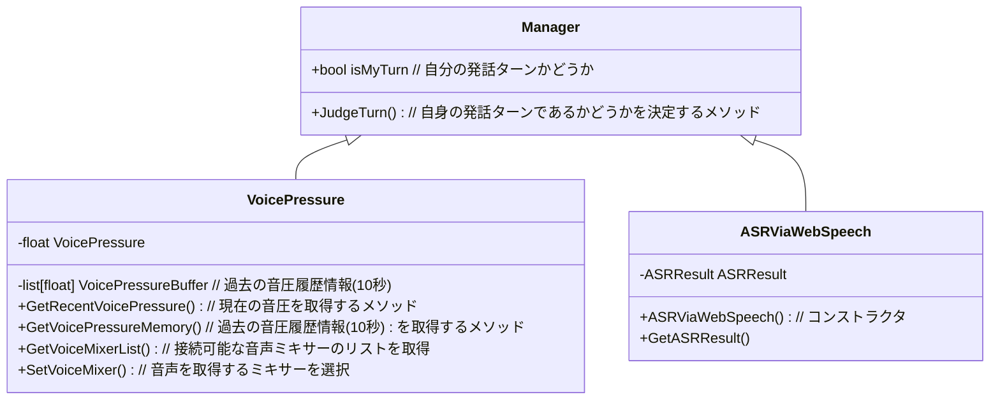

# TurnTakingDetectorの設計図
### このアプリについて
WPFを用いて実装している。デザインパターンはMVVM(View-ViewModel-Model)を採用する。

## View側
基本的に、音声を取得するミキサーを選択するコンボボックスと、音声認識と
ターンテーキングへの判断処理結果を示すテキストボックス、
処理開始ボタンの3つを表示する<br/>
音圧のグラフもリアルタイムで表示できるようにする

## ViewModel側
基本的にView側からの入力をManager側に流す。
また、Manager側からえら得た結果をView側に反映する。

Manager側に流す際は、コマンドを用いる。
Manager側の情報をViewModelに、ViewModel側の情報をViewに反映する際に、イベントを用いる。<br/>
リアルタイムでの音圧情報を入れるリストをViewModel側にもって置き、View側でバインドするようにする

## Model側
すべての情報を統合し、最終判断を行うManagerメソッドと、音圧を取得するメソッド、WebSpeechAPI
により取得した3つのメソッドから構成する。

~~将来的には、相手の発話意欲、傾聴意欲を元に、ローカルLLMからリアルタイムで言語処理により
決定できる機能も実装予定~~

~~井上先生のMaaiについても組み合わせたいが、まだ詳細は詰めない~~



### WebSpeechAPIから受信した結果のフォーマット
```ASRResult.cs
 class ASRResult{
    public readonly bool IsComplete { get; set;}
    public readonly string DetectUtter { get; set;}
 }
```

### WebSpeechAPIから音声認識結果を受け取る方法
ASRViewWebSpeechのコンストラクタに、WebSpeechAPIを用いて音声認識を行うコードを実行
するメソッドを実装

C#からhtml+javascriptコードの実行はwebViewを用いて実行

```ExecuteASRRecognition.html
<!DOCTYPE html>
<html>
    <body>
        <button onclick="start()">音声認識開始</button>
        <p id="result"></p>
    </body>
</html>
```
音声認識を行うJavaScriptのコード
```ASRRecognition.js
const recog = new webkitSpeechRecognition();
recog.lang = selectLang; # ex."ja-JP";
recog.interimResults = true; // 途中の音声認識結果も取得
recog.continuous = true;

recog.onresult = function(event){
    var results = event.results;

    for(var i = results.resultIndex; i<results.length; i++){
        if(results[i].isFinal){
            text = result[i][0].transcript;
        }
        else{
            text = result[i][0].transcript;
        }
    }

    window.chrome.webview.postMessage(text);
}

recog.start(); // 音声認識処理を開始
```

C#側で、音声認識結果を受信するメソッド
```recvASR.cs
private void ASRResultRecv(object sender, CoreWebView2WebMessageReceivedEventArgs e){
    string text = e.TryGetWebMessageAsString()
}
```

### 音圧を取得するメソッド
音声デバイスの取得
```getDevice.cs
using NAudio.CoreAudioApi;
using MAudio.Wave;

var enumerator = new MMDeviceEnumerator();
var devices = enumerator.EnumerateAudioEndPoints(DataFlow.Capture, DeviceState.Active);

foreach(var device in devices){
}
```

リアルタイムでの音声取得
```realtimeAudio.cs
MMDevice device = new MMDeviceEnumerator().GetDefaultAudioEndpoint(DataFlow.Capture, Role.Console);

var capture = new WasapiCapture(device);

capture.DataAvailable += (s, e) => {  // 大体10~20ms毎に呼ばれる
    byte[] buffer = new byte[e.BytesRecoders];
    Array.Copy(e.Buffer, buffer, e.BytesRecored);
}

capture.StartRecording();
```
